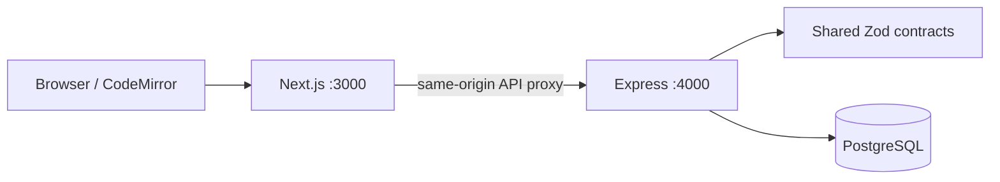

# Phase 1 architecture

The browser loads a Next.js app and calls `/api` on the same origin. Next.js proxies requests to the Express service. Express authenticates a session, validates requests with shared Zod schemas, checks room membership, and reads or updates PostgreSQL through Drizzle.

## Durable state

`users` owns profile information and password hashes. `sessions` stores only token hashes with seven-day expiry. `rooms` and `room_members` store ownership, roles and membership. `files` stores the tree, current content and version. `invites` stores a token hash, expiry and assigned role. UUIDs are generated in the application.

The SQL migration adds foreign keys and uniqueness constraints for emails, room memberships and file paths. Composite room/parent foreign keys prevent cross-room file trees and cascade folder deletion. Drizzle defines the query types; `packages/db/migrations/0001_core.sql` is the executable migration. Development runs the idempotent initial migration on startup. Production migrations are an explicit deployment step. Add new numbered migrations and a runner before evolving the schema beyond this initial release.

## Permissions and concurrency

Owners administer rooms and memberships. Owners and editors mutate files. Viewers read files. Every room/file operation checks backend membership; hiding controls is only a usability measure.

Room mutations lock the room row in a transaction before checking membership. This serializes file operations and role changes within a room, so a write cannot race with a permission revocation. Different rooms can proceed independently. This deliberately simple Phase 1 strategy should be revisited for high write throughput.

Saving conditionally updates a file by ID and expected version and increments that version. A stale save returns 409. The client retains the draft and offers download/reload recovery. Folder renames update every descendant path in one transaction. Conflicting names roll back the entire rename.

## Authentication boundary

Node scrypt hashes passwords with a random salt; session and invite tokens use 32 cryptographically random bytes and SHA-256 hashes at rest. Production cookies use the `__Host-` prefix, Secure, HttpOnly, SameSite=Lax and a root path. Authentication errors do not disclose whether an account exists at login.

All unsafe requests require `X-CodeTogether: 1`; an Origin header, when present, must exactly match `APP_ORIGIN`. Cross-origin CORS is not enabled. The custom header forces a preflight for cross-origin browser requests; the server does not permit that preflight. Authentication endpoints have a process-local rate limit. Distributed limits and expired-record cleanup are later hardening work.

## Development database

PGlite provides a local PostgreSQL runtime using the same SQL migration and queries. Its connection is normalized to the Drizzle PostgreSQL query surface in one adapter. Production requires `DATABASE_URL`. CI runs the API suite against a real PostgreSQL service to catch driver differences.

## Client behavior

Room state is loaded on entry or explicit refresh. File content is fetched again when switching files. Unsaved drafts stay in memory and warn before switching files, using in-app back navigation, or closing/reloading the page. Browser/process crashes can still lose unsaved drafts; save explicitly. There is no background polling, realtime transport or executable-code service in this phase.
