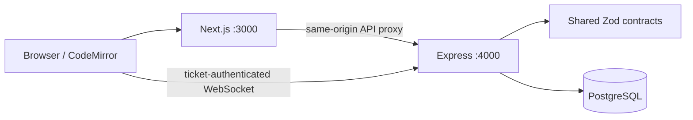

# CodeTogether architecture

The browser loads a Next.js app and calls `/api` on the same origin. Next.js proxies requests to the Express service. Express authenticates a session, validates requests with shared Zod schemas, checks room membership, and reads or updates PostgreSQL through Drizzle.

## Durable state

`users` owns profile information and password hashes. `sessions` stores only token hashes with seven-day expiry. `rooms` and `room_members` store ownership, roles and membership. `files` stores the tree, current content and version. `invites` stores a token hash, expiry and assigned role. UUIDs are generated in the application.

The SQL migrations add foreign keys and uniqueness constraints for emails, room memberships and file paths. Composite room/parent foreign keys prevent cross-room file trees and cascade folder deletion. The runner executes numbered, idempotent SQL files in lexical order on one connection; each file has its own transaction and records its version. Migration `0002_chat.sql` adds messages, monotonic sequence cursors and retry uniqueness. Development migrates on startup; production runs `npm run db:migrate` explicitly before starting the service. New migrations must remain idempotent because the runner replays them.

## Permissions and concurrency

Owners administer rooms and memberships. Owners and editors mutate files. Viewers read files. Every room/file operation checks backend membership; hiding controls is only a usability measure.

Room mutations lock the room row in a transaction before checking membership. This serializes file operations and role changes within a room, so a write cannot race with a permission revocation. Different rooms can proceed independently. This deliberately simple Phase 1 strategy should be revisited for high write throughput.

Saving conditionally updates a file by ID and expected version and increments that version. A stale save returns 409. The client retains the draft and offers download/reload recovery. Folder renames update every descendant path in one transaction. Conflicting names roll back the entire rename.

## Authentication boundary

Node scrypt hashes passwords with a random salt; session and invite tokens use 32 cryptographically random bytes and SHA-256 hashes at rest. Production cookies use the `__Host-` prefix, Secure, HttpOnly, SameSite=Lax and a root path. Authentication errors do not disclose whether an account exists at login.

All unsafe requests require `X-CodeTogether: 1`; an Origin header, when present, must exactly match `APP_ORIGIN`. Cross-origin CORS is not enabled. The custom header forces a preflight for cross-origin browser requests; the server does not permit that preflight. Authentication endpoints have a process-local rate limit. Distributed limits and expired-record cleanup are later hardening work.

## Development database

PGlite provides a local PostgreSQL runtime using the same SQL migration and queries. Its connection is normalized to the Drizzle PostgreSQL query surface in one adapter. Production requires `DATABASE_URL`. CI runs the API suite against a real PostgreSQL service to catch driver differences.

## Client behavior

Room state is loaded on entry, explicit refresh, server events and reconnect. These background refreshes update room metadata, roles and the explorer, but never replace the open editor buffer or its base version. The UI announces a newer saved version or deleted file; explicit refresh retains the discard confirmation. File content is fetched when switching files. Drafts remain in memory and downloadable even after demotion/removal; browser crashes can lose them. There is no collaborative document transport or executable-code service.

## Realtime boundary

The Express HTTP server also hosts Socket.IO, using WebSocket transport only. A CSRF-protected same-origin POST exchanges the HttpOnly session for a random single-use ticket held in memory for 30 seconds. The browser sends that ticket in the Socket.IO auth packet, never in a query string; it never reads or forwards the session cookie itself. The Render endpoint rejects absent/foreign Origin headers, consumes the ticket atomically, and looks up its linked session in PostgreSQL. No shared signing secret or third-party service is added.

A process-local room queue wraps HTTP mutations, subscriptions, sends, revocations and broadcasts. Database row locks still serialize mutations; the queue also orders post-commit event delivery with access changes. Every socket action and recipient rechecks current session/membership. An idle sweep rechecks sessions and memberships every 15 seconds. Expired sessions disconnect; normal logout/rotation disconnects their sockets immediately. Presence derives from all authorized connected sockets and deduplicates by server-side user ID.

Chat commits before broadcast/ack. The database unique key `(room_id, user_id, client_message_id)` makes acknowledgment-loss retries idempotent. A conflicting body under the same key is rejected. A monotonic database sequence avoids timestamp cursor ambiguity. Reconnect uses a fresh ticket, rejoins with current permissions, fetches messages after the last known sequence, and reloads room metadata without touching drafts. Room events are invalidations, not a durable event log; PostgreSQL is the recovery source.

Use one realtime instance until a shared ticket store, distributed coordination/limits and Socket.IO adapter are introduced. See [contracts, limits and deployment](phase-2.md).
